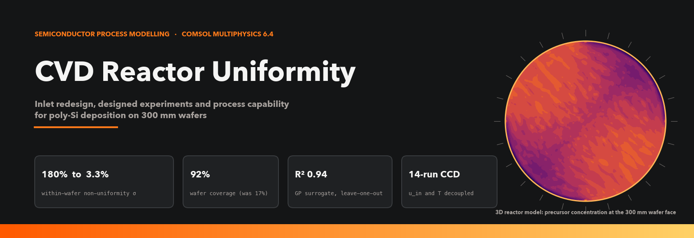
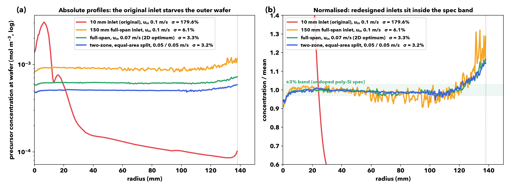
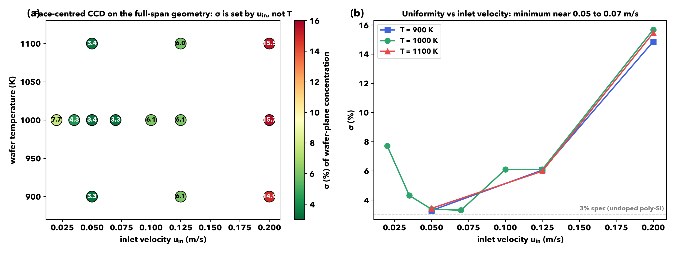
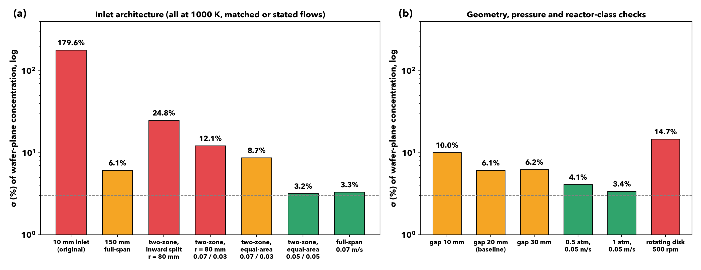
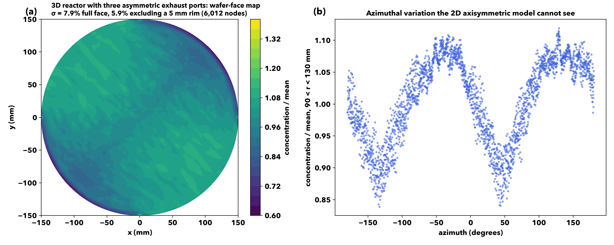
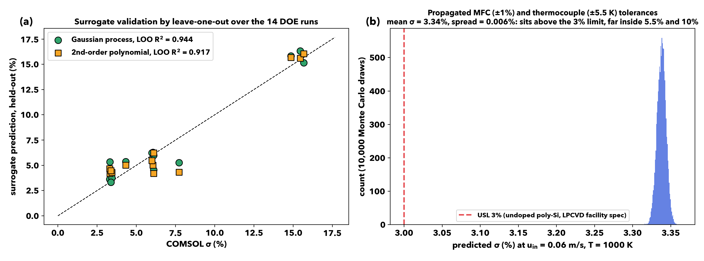

<p align="center"></p>

<div align="center">

[](https://www.comsol.com)
[](#model)
[-0b1220?style=flat-square)](#design-of-experiments)
[](#process-capability)
[](analysis)

**Soham Kavathekar** · MS Chemical & Biomolecular Engineering, University of Pennsylvania
[stg3719@seas.upenn.edu](mailto:stg3719@seas.upenn.edu) · [LinkedIn](https://www.linkedin.com/in/soham-kavathekar-cheme)

</div>

---

## What this is

A finite-element model of an atmospheric-pressure CVD reactor depositing polycrystalline silicon from a silane-like precursor onto a **300 mm wafer**, used to find out why the deposit was grossly non-uniform and to redesign the gas inlet until it was not. The work follows the sequence a process engineer would use on a real tool: diagnose the transport regime, fix the geometry, run a designed experiment, fit a surrogate, and estimate process capability against a published film-thickness spec, with the model's limitations stated rather than hidden.

Every number in this README is computed from the COMSOL exports in [`data/`](data) by the scripts in [`analysis/`](analysis). The three `.mph` model files are in [`models/`](models).

| | Before (10 mm inlet) | After (150 mm full-span, 0.07 m/s) |
|---|---|---|
| Within-wafer non-uniformity σ (coefficient of variation of precursor concentration at the wafer plane, r ≤ 138 mm) | **179.6 %** | **3.3 %** |
| Wafer coverage (radius where concentration falls to 10 % of peak) | 16.9 % | 91.9 % |
| Regime | mass-transfer-limited, precursor starved beyond r ≈ 25 mm | near-uniform supply; edge rise from exhaust proximity |

<p align="center"></p>

---

## Model

| Item | Choice | Basis |
|---|---|---|
| Geometry | 2D axisymmetric chamber, 300 mm wafer, 20 mm wafer-to-inlet gap, sidewall exhaust slit | US 6,022,811 (Mitsubishi Electric) gas head to wafer diameter ratio; gap swept 10/20/30 mm as a factor |
| Physics | Laminar flow, heat transfer in fluids, transport of a dilute species, coupled | steady state; transient film growth attempted with ALE (see limitations) |
| Carrier gas | N₂, T-dependent μ (Sutherland), C<sub>p</sub> (NIST-JANAF) and k (Lemmon & Jacobsen 2004) | sourced per property; viscosity re-derived by hand |
| Precursor | generic species with silane kinetics: surface rate constant k<sub>s</sub> from Hashimoto et al. (1990), Arrhenius; diffusivity D = 2.0×10⁻⁵ m² s⁻¹ (298 K) × (T/298)^1.75 | Han et al. 2024 base value, Fuller temperature exponent checked against Chapman-Enskog |
| Wafer boundary | first-order surface consumption, flux = −k<sub>s</sub>·c | deposition-rate proxy; thickness profile is a linear scaling of c(r) under the frozen-field assumption |
| Operating window | u<sub>in</sub> 0.02 to 0.20 m s⁻¹, T<sub>wafer</sub> 900 to 1100 K, 1 atm | APCVD conditions; k<sub>s</sub> at 900 K is a ~70 K extrapolation of the published range and is labelled as such |

The precursor was never given a named chemical identity in COMSOL. The honest description is "a silane-like species with reaction and transport parameters from the silane CVD literature", and that is the phrase used throughout.

---

## What was found

### 1. The original inlet was the problem, not the chemistry

With a 10 mm central inlet the Damköhler number (surface consumption over convective supply) sat above 10: the precursor was consumed within the first ~25 mm of radius and the outer 83 % of the wafer saw almost nothing (σ = 180 %, coverage 17 %). Widening the inlet to the wafer diameter, the ratio the Mitsubishi patent uses, brought σ to 6.1 % and coverage to 92 % at the same flow. Nothing else changed.

### 2. Inlet velocity controls uniformity; wafer temperature does not

A face-centred central composite design over u<sub>in</sub> and T<sub>wafer</sub> (14 COMSOL runs on the full-span geometry) shows σ falling from 15.7 % at 0.20 m s⁻¹ to 3.3 % at 0.07 m s⁻¹ and rising again below 0.035 m s⁻¹, while changing T<sub>wafer</sub> by ±100 K moves σ by less than 0.2 percentage points at any velocity. Velocity and temperature are decoupled, which means throughput (set by T through k<sub>s</sub>) can be tuned without spoiling uniformity.

<p align="center"></p>

### 3. Two-zone inlets help only when the split is placed correctly

Splitting the inlet at r = 80 mm (an "inward" split) and biasing flow to the outer zone gave σ = 24.8 % at matched total flow, worse than the single full-span inlet. Splitting at the **equal-area radius** (106.07 mm) recovered 8.7 % with the same 0.07/0.03 velocity pair and 3.2 % with equal zone velocities. The equal-area split is the neutral starting point recommended in the methodology notes, not a claimed optimum.

<p align="center"></p>

The right-hand panel shows the sensitivity checks: a 10 mm gap degrades σ to 10 %, 30 mm changes little, halving pressure at low velocity is mildly worse than 1 atm, and a rotating-disk configuration at 500 rpm is a different reactor class that does not transfer to this geometry (14.7 %).

### 4. 3D with asymmetric exhaust ports: what 2D cannot see

A 3D model with three discrete exhaust ports (a real reactor is built that way) reproduces the radial trend but adds an azimuthal ripple of about ±10 % at mid-radius, tied to the port positions. The wafer-face coefficient of variation is **7.9 % over the full face and 5.9 % excluding a 5 mm edge rim** (6,012 surface nodes). This is a surface (over-area) statistic and is not the same metric as the 1D radial σ of the 2D runs; the two should not be compared as if they were.

<p align="center"></p>

### 5. Process capability, labelled for what it is

A Gaussian-process surrogate fitted to the 14 DOE runs validates at **leave-one-out R² = 0.944** (a second-order polynomial gives 0.917). Propagating sourced equipment tolerances through it (mass-flow controller ±1 % of setpoint, Type K class 2 thermocouple ±5.5 K at 1000 K) with 10,000 Monte Carlo draws at u<sub>in</sub> = 0.06 m s⁻¹ gives a predicted σ of 3.34 % with a spread of only 0.006 %. Against the University of Waterloo QNC LPCVD facility specs (3 % for undoped poly-Si, 10 % for doped), the design sits just **above** the tight 3 % limit and far inside the 10 % one.

<p align="center"></p>

Two caveats belong next to that result. COMSOL is deterministic, so the Monte Carlo spread is propagated *input* uncertainty, not measured run-to-run repeatability; a Cpk computed from it is a model-based sensitivity estimate, not demonstrated capability. And the spec source is an LPCVD tool for 100 mm wafers, the same chemistry family but a different pressure regime and wafer size.

---

## Design of experiments

The DOE was generated with pyDOE3 (`analysis/generate_doe_v2.py`), a face-centred CCD over u<sub>in</sub> (0.05 to 0.20 m s⁻¹) and T<sub>wafer</sub> (900 to 1100 K), centred on the validated full-span baseline, and extended with additional axial points down to 0.02 m s⁻¹ once the optimum was seen to lie below the design centre. A benchmark at 3.41 m s⁻¹ failed to converge and defines the upper limit of the valid region. Every run is an exported wafer-plane profile in `data/`; `analysis/full_analysis.py` recomputes σ and coverage for all of them in one call.

## Sourcing discipline

Thirteen modelling questions were tracked to closure before the redesign was trusted; ten were resolved with citations, two are proprietary and handled as declared simplifications, one (wafer rotation) was deliberately kept out because the only available numbers belong to a different reactor class. The full table is in [`docs/Open_Questions_Resolved.md`](docs/Open_Questions_Resolved.md); the working plan, including what was verified and what was only hypothesised, is in [`docs/CVD_Action_Plan_2D_3D.md`](docs/CVD_Action_Plan_2D_3D.md).

## Limitations

- Steady-state concentration is used as the deposition proxy. A transient moving-boundary (ALE) film-growth study was set up but did not converge; the frozen-field approximation in `analysis/growth_approximation.py` shows thickness σ equal to concentration σ (3.32 %) by construction and cannot reveal any time evolution.
- Precursor utilisation is very low (0.17 % of inlet flux consumed in the baseline). Uniformity and utilisation should be optimised together in a follow-up; this study optimised uniformity.
- Kinetics are single-mechanism Arrhenius; gas-phase decomposition and multi-step surface chemistry are not included.
- The 3D result is from a single configuration and is not mesh-independence-tested across the same sweep as the 2D runs.

## Reproduce

```bash
git clone https://github.com/Soham-ChemE/CVD-Reactor-Uniformity-COMSOL.git
cd CVD-Reactor-Uniformity-COMSOL
pip install numpy scipy scikit-learn matplotlib pyDOE3
python analysis/full_analysis.py          # σ and coverage for every exported profile
python analysis/wafer_3D_sigma.py         # 3D wafer-face statistics
python analysis/real_cpk_pipeline_v4.py   # surrogate, LOO validation, Monte Carlo, Cpk
python make_cvd_figs.py                   # regenerates every figure above
```

The `.mph` files open in COMSOL Multiphysics 6.4 or later.

```
CVD-Reactor-Uniformity-COMSOL/
├── models/          CVD_Reactor_Run1_Baseline.mph, CVD_Reactor_SingleZone_Complete*.mph
├── data/            COMSOL exports: wafer-plane profiles, temperature fields, 3D wafer surface, DOE design
│   └── old_runs/    original 10 mm inlet geometry (the "before" case)
├── analysis/        σ / coverage, DOE generation, surrogate + Monte Carlo Cpk, growth approximation
├── docs/            methodology notes and the sourcing table
├── figures/         generated figures
└── make_cvd_figs.py
```

## Framing for different audiences

For semiconductor tool and process roles this is exactly what it looks like: a showerhead-class APCVD uniformity study on a 300 mm silicon wafer. For battery-manufacturing roles the hardware does not transfer (electrode coating is roll-to-roll or fluidised-bed), but the method does: identify the transport regime with a Damköhler number, fix the geometry that sets it, then use a designed experiment and a validated surrogate to map the process window before touching the tool.
